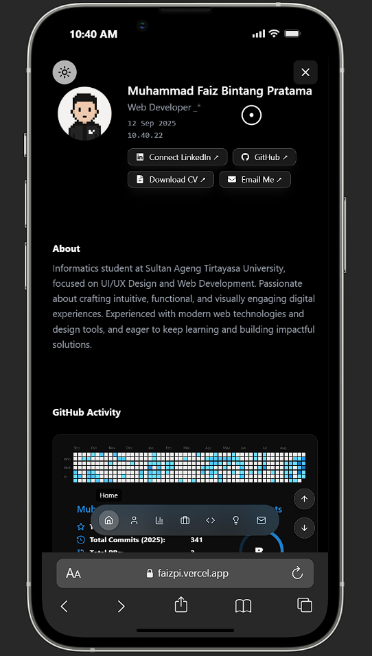
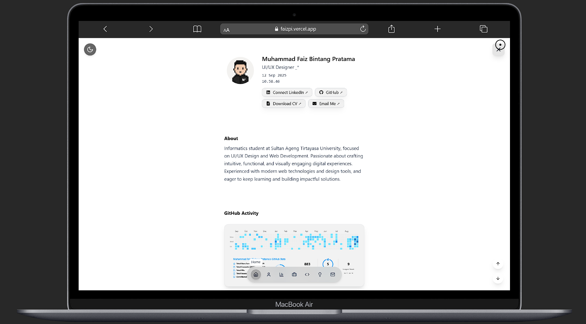
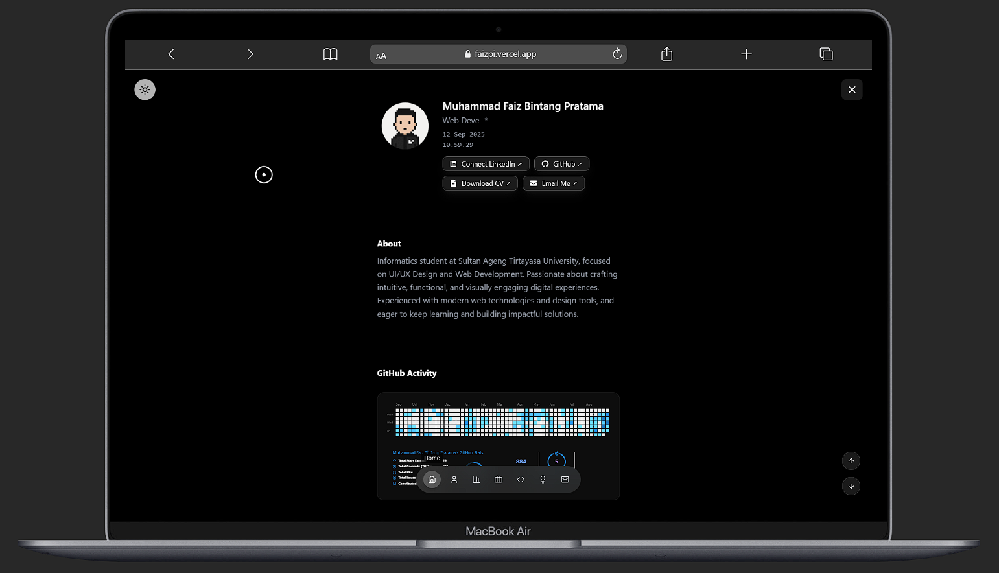

# 🌌 Personal Portfolio - Muhammad Faiz Bintang Pratama

> A modern, interactive portfolio website showcasing my work as a **UI/UX Designer** and **Web Developer**.

---

## 📸 Screenshots

### 📱 Mobile View
| Home | About / Stats |
|------|---------------|
|  |  |

### 💻 Desktop View
| Home | About / Stats |
|------|---------------|
|  |  |

---

## 🚀 Live Demo
[View Portfolio](your-portfolio-url.com) • [GitHub Repository](https://github.com/Faizpi/portfolio)

---

## ✨ Features

### 🎨 **Modern UI/UX**
- **Dark & Light Mode Toggle** - Smooth theme switching with ripple animation
- **Custom Cursor** - Interactive dot and trailing ring cursor
- **Responsive Design** - Optimized for all screen sizes

### 🎬 **Interactive Animations**
- **Typewriter Effect** - Dynamic role showcase animation
- **Reveal Animations** - Smooth section transitions using Framer Motion
- **Real-time Clock** - Live digital clock display

### 📊 **GitHub Integration**
- Live contribution graph
- Dynamic stats cards
- Streak statistics
- Automatic theme synchronization

---

## 🛠️ Tech Stack

| Frontend | Animation | Icons | Tools |
|----------|-----------|--------|-------|
| React  | Framer Motion | Lucide Icons | Tailwind CSS |
| JavaScript | CSS Transitions | React Icons | NPM |

### Key Dependencies
- **[React](https://react.dev/)** - UI library
- **[Tailwind CSS](https://tailwindcss.com/)** - Utility-first CSS framework
- **[Framer Motion](https://framer.com/motion/)** - Animation library
- **[react-simple-typewriter](https://npmjs.com/package/react-simple-typewriter)** - Typewriter effect

---

## 🚀 Quick Start

### Prerequisites
- Node.js (v16 or higher)
- npm or yarn

### Installation

1. **Clone the repository**
   ```bash
   git clone https://github.com/Faizpi/portfolio.git
   cd portfolio
   ```

2. **Install dependencies**
   ```bash
   npm install
   ```

3. **Start development server**
   ```bash
   npm run dev
   ```

4. **Build for production**
   ```bash
   npm run build
   ```

---

## 🤝 Connect With Me

[](your-linkedin-url)
[](https://github.com/Faizpi)
[](mailto:your-email@gmail.com)
[](your-whatsapp-url)
[](your-instagram-url)

---

## 📄 License

This project is open source and available under the [MIT License](LICENSE).

---

## ⭐ Support

If you found this project helpful, please give it a ⭐ on GitHub and share it with others!

---

<div align="center">
  <strong>Made with ❤️ by Muhammad Faiz Bintang Pratama</strong>
</div>